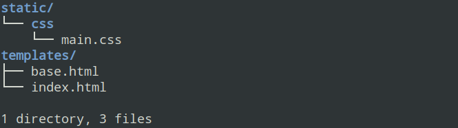
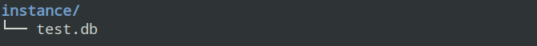
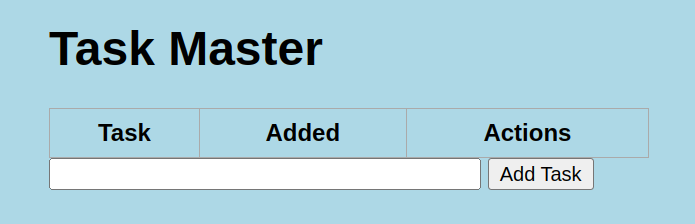

# Introducción a Flask 

Este es un tutorial acerca de Flask y la contenerización de una aplicación basada en Flask en una imagen de contenedor de Docker. 
Así mismo, se hace una explicación de la manera como se puede usar una base de datos como PostgreSQL como el _backend_ de nuestra aplicación.

Para continuar, por favor ir al _branch_ cuyo nombre es `paso-01`.

## `paso-01`

Inicialmente se creará el espacio donde las librerías y dependencias de nuestra aplicación se instalarán.

```
python3 -m venv venv
```

Una vez se tiene el espacio, se pasa a la activación de este espacio para poder llevar a cabo allí la instalación de paquetes y librerías que usará nuestra aplicación.

```
source venv/bin/activate
```

Se crea ahora un archivo llamado `requirements.txt` que contiene las siguientes líneas:

```
flask
flask-sqlalchemy
```

A continuación veremos el código tipo `hola mundo` en Flask.
Se creará un archivo llamado `app.py` que contiene las siguientes líneas:

```python
from flask import Flask

app = Flask(__name__)

@app.route('/')
def index():
	return "Hello, world"

if __name__ == "__main__":
	app.run(host='0.0.0.0',debug=True)
```

Una vez se han instalado las librerías y se ha creado el archivo `app.py` se procede a ejecutar el programa en este archivo.

```
python3 app.py
```

Una vez se ejecuta el navegador, un mensaje como el siguiente debería aparecer en pantalla:

```
 * Serving Flask app 'app'                                                                                                                                                   
 * Debug mode: on                                                                                                                                                            
WARNING: This is a development server. Do not use it in a production deployment. Use a production WSGI server instead.                                                       
 * Running on all addresses (0.0.0.0)                                                                                                                                        
 * Running on http://127.0.0.1:5000                                                                                                                                          
Press CTRL+C to quit                                                                                                                                                         
 * Restarting with stat                                                                                                                                                      
 * Debugger is active!
 * Debugger PIN: 169-269-208
```

Abrir ahora un navegador en la dirección `http://localhost:5000`.

Continuar con el `paso-02`.

## `paso-02`

En este paso vamos a usar hojas de estilo y `templates` con Flask. 
En la versión del archivo `app.py` anterior lo que se arrojaba o devolvía el método `index()` era una cadena de caracteres. 
En esta versión lo que devolverá esta función es un archivo `.html` que se encuentra en la carpeta `templates` y que está formateado con hoja de estilo CSS.

En esta nueva versión de nuestro programa ocurren los siguientes cambios:

* Se crean los directorios `templates` y `static/css`. Dentro de estos directorios se ubican los archivos `index.html` y `base.html` en el directorio `templates` y `main.css` en el directorio `static/css`.



* Se modifica el archivo `app.py` de modo que ahora se renderice una página HTML y se incluyen algunos módulos en el script que permiten que esta página sea renderizada adecuadamente.

## `paso-03` 

En este paso nos encargamos de hacer los cambios pertinentes en la aplicación para que los datos que gestiona esta aplicación queden almacenados correctamente en una base de datos relacional, en este caso SQLite. 
Inicialmente, se modifica el archivo `app.py`.

* Se indica la cadena de conexión a la base de datos a través de la inicialización de la variable `app.config['SQLALCHEMY_DATABASE_URI']`.
* Se define una clase la cual será la encargada de representar los datos básicos que gestiona nuestra aplicación. La clase es `Todo`.

Una vez se hace el cambio del archivo se crea un archivo en Python llamado `create_db.py`. 
Este archivo contiene la siguiente información:

```python
#!/usr/bin/env python3
from app import app,db
app.app_context().push()
db.create_all()
```

Una vez se tiene este archivo se ejecuta:

```
python3 create_db.py
```

La ejecución de este archivo crea un directorio llamado `instance`.



Se lanza nuevamente la ejecución de nuestra aplicación:

```
python3 app.py
```

Seguimos con el `paso-04`.

## `paso-04`

En este paso se harán modificaciones de forma y afectarán a los archivos `static/css/main.css` y `templates/index.html`.
También se presentan unos cambios menores en el archivo `app.py`.

Se hacen los cambios en los archivo y se ejecuta nuevamente la aplicación. 

```
python3 app.py
```

La interfaz debería tener una apariencia similar a esto:



**IMPORTANTE** al momento no hay nada funcional solo hay decoración. 
En los próximos pasos se llevará a cabo la adición de la funcionalidad de la aplicación.

## `paso-05` 

En este paso se harán las modificaciones que permitirán crear nuevas tareas.
Se hará la modificación del archivo `app.py`, en particular, al método `index()` y al decorador de este método, `@app.route...`.

Una vez hechas las modificaciones ya será posible adicionar tareas a la aplicación.

## `paso-06`

En este paso se habilitará la posibilidad de borrar tareas y actualizarlas. 
Para ello se modifican:

* Archivo `app.py` y donde se definirán funciones en Python para borrar y actualizar tareas. 

* Archivo `templates/index.html` de modo que se habiliten enlaces en la tabla donde se presentan las tareas para que se puedan invocar los métodos de borrado y actualización de tareas.

Se crea adicionalmente un archivo llamado `templates/update.html` y el cual contendrá una interfaz que permita al usuario cambiar la descripción de la tarea.

## `paso-07`

En este paso se creará una imagen de Docker con esta aplicación en su interior. 
Se crea un archivo `Dockerfile` con las siguientes líneas:

```
FROM python:3.11.3-bullseye
WORKDIR /app
ENV FLASK_HOST="0.0.0.0"
COPY requirements.txt requirements.txt
RUN pip install -r requirements.txt
COPY . .
EXPOSE 5000
CMD ["python3", "app.py"]
```

La imagen de contenedor se crea con el siguiente comando:

```
docker image build -t myapp:0.0.1 .
```

Una vez creada la imagen se puede ejecutar de la siguiente manera:

```
docker container run --rm -p 5000:5000 --name myapp myapp:0.0.1
```

Ya puede abrir su navegador e ir a este enlace <http://localhost:5000>
